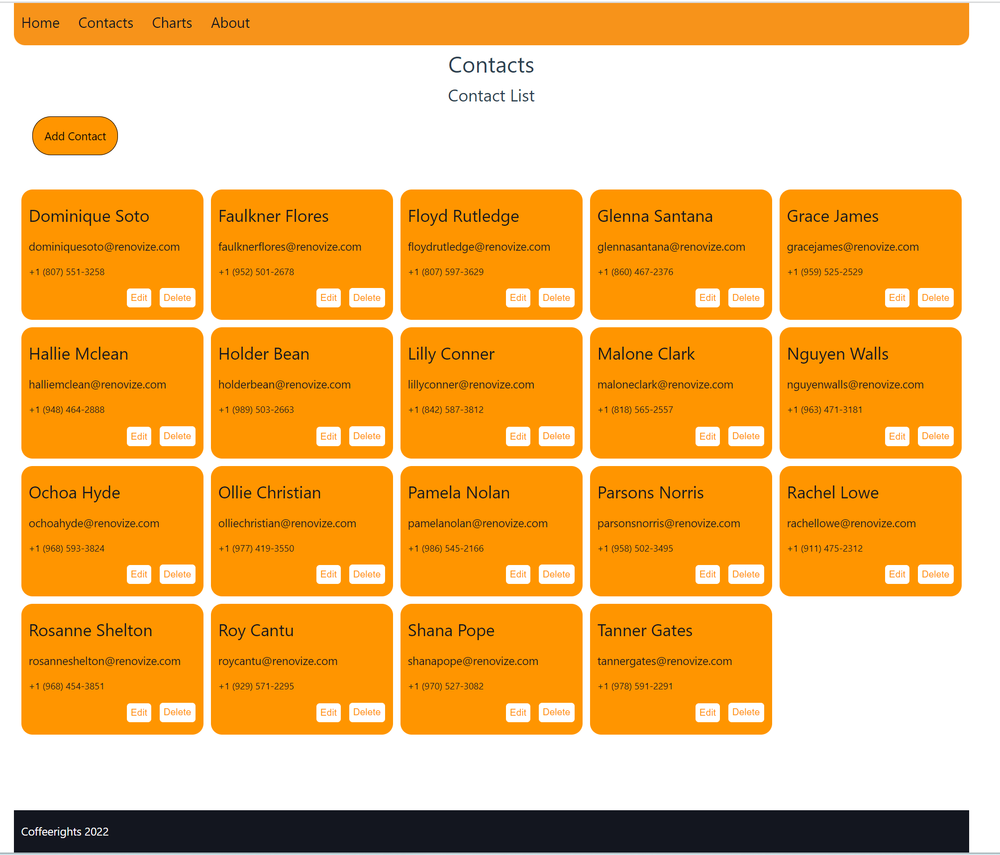

# Mr.BitCoin
<p>This application showcase my abilities in Vue. In a week long Vue workshop as a part of Coding Academy Full Stack bootcamp, i created Mr. Bitcoin, a crypto wallet.</p>

You can check it out [here](https://esheleyni.github.io/mrbitcoin/#/).


___

### Table of Contents
- [Description](#description)
- [Features](#features)
- [Getting started](#getting-started)
- [Showcase](#showcase)

## Description
Mr. Bitcoin is a crypto wallet. You can sign in and get a balance of 100 fake bitcoins. 
The app header let's you choose a currency and get the bitcoin rate per that currency.
In the contacts page, that supports basic CRUDL, you can choose a contact and transfer them bitcoins from your balance.
In the chart page you can view information about the bitcoin rate the previous year..


A bit about the project - a small App that was built in a few days, which provides the user a list of contacts that they can transfer money to, a basic CRUDL and some information about the value of their fake bank currency in Bitcoin.

You are more than welcome to ***check it out***. Just enter your name and see it yourself - [right here](https://esheleyni.github.io/mrbitcoin/#/)


#### Technologies

- Vue 3
- Vue chart.js
- Vue-Router
- Vuex
- Sass
- Vue CLI & Github pages

## Features
Please feel free to take a look of the different components of the website - [Showcase](#showcase)

- Simple authentication - store and local storage.
- HTTP request for Market price, Bitcoin rate and more.
- Presenting data in a dashboard using charts & 3rd side library.
- CRUDL of contacts, along with User messages for different actions.
- Responsive and well designed.


## Getting started
Clone the project or dowload the files on top.
```
git clonehttps://github.com/EshelEyni/mrbitcoin.git
```
Open the terminal and enter the following line to run it locally on your computer:
```
npm run dev 
```
Runs the app in the development mode.
Open http://localhost:5173 to view it in the browser.

## Showcase

### Home page


### Contacts
You can view your contacts, filter them by name, add, edit and delete a contact.
In addition, you can transfer money, to one of your contacts by pressing on them and click on the "transfer" button.




